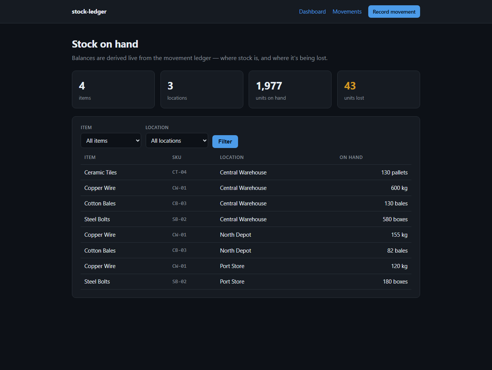
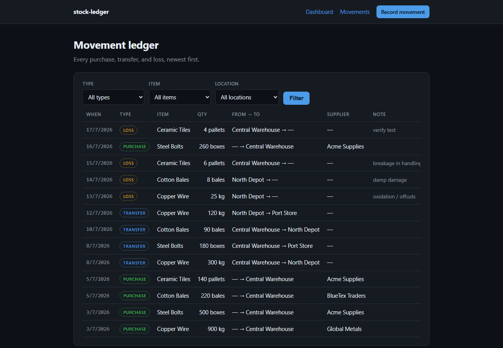

# stock-ledger

**An inventory & stock-movement tracker — where stock is, and where it's being lost.**

Record purchases, transfers between locations, and losses; the app derives
**on-hand balances live from the movement ledger** and surfaces where stock is
disappearing. Built to make a physical goods operation **visible**: what came in,
what's where, and what leaked out.

> This is a **clean-room build** — an independent, generic reimplementation of the
> kind of inventory system I helped build for a real trading business, rebuilt from
> scratch with a made-up domain (warehouse goods) and entirely synthetic data. It
> contains no company code or data.

**▶ Live demo:** https://stock-ledger-anamikaprakash26s-projects.vercel.app





---

## What it does

- **Dashboard** — on-hand stock per item × location, with headline totals
  (units on hand, **units lost**) and **filters** by item and location.
- **Movement ledger** — every `PURCHASE`, `TRANSFER`, and `LOSS`, filterable by
  type, item, and location.
- **Record a movement** — a form that adapts to the movement type (a purchase
  needs a supplier + destination; a transfer needs two locations; a loss needs a
  source), with server-side validation.

## The engineering worth looking at

| Idea | How it works | Where |
| --- | --- | --- |
| **Derived balances (event-sourced)** | On-hand is **never stored** — it's computed by folding the movement ledger (`PURCHASE +qty`, `TRANSFER −/＋`, `LOSS −qty`). History and totals can't drift out of sync. | `lib/stock.ts` |
| **Typed movement model** | One `StockMovement` table models three flows via nullable `from`/`to`/`supplier` relations, indexed for lookups. | `prisma/schema.prisma` |
| **Type-aware form + validation** | The client form shows only the fields each movement type needs; the API re-validates the shape server-side (a transfer must have two distinct locations, etc.). | `app/new/record-form.tsx`, `app/api/movements/route.ts` |
| **Filtering** | Dashboard and ledger filter by item / location / type via query params, fully server-rendered. | `app/page.tsx`, `app/movements/page.tsx` |

## Stack

Next.js 15 (App Router, Server Components, Route Handlers) · TypeScript · Prisma
ORM · **Postgres** (Neon) · deployed on **Vercel**.

## Run it locally

You need a Postgres database — the quickest is a free one from [Neon](https://neon.tech).

```bash
npm install
cp .env.example .env   # paste your Postgres URL into DATABASE_URL
npm run setup          # applies migrations + seeds demo data
npm run dev            # http://localhost:3000
```

Then record a movement and watch the dashboard balances change; filter by a
location to see just what's sitting there.

## Deploy (Vercel + Neon)

1. Create a free Postgres database at [neon.tech](https://neon.tech) and copy its
   connection string (the **Direct**/unpooled one).
2. Import this repo at [vercel.com/new](https://vercel.com/new).
3. In **Settings → Environment Variables**, add `DATABASE_URL` = your Neon string.
4. Deploy — the `vercel-build` script runs `prisma migrate deploy` automatically.
5. Seed the demo data once, locally pointed at Neon: `npm run seed`.

## Project layout

```
prisma/schema.prisma   Item · Location · Supplier · StockMovement (the ledger)
prisma/seed.ts         synthetic warehouse data (purchases, transfers, losses)
lib/stock.ts           derive on-hand balances + totals from movements
app/page.tsx           dashboard — stock on hand, totals, filters
app/movements/         the movement ledger, filterable
app/new/               record a movement (type-aware form + API)
```

---

## Case study — the real project behind this

This demo generalises an inventory system I worked on for a family-run goods
**trading & processing business**, where the core problem was *visibility*: stock
moved between yards and contractors, quantities were logged on paper, and
**losses during processing were hard to see**. My involvement spanned the whole
build:

- **Product & requirements** — sat with the business to map the real flow
  (purchase → quality check → processing → stock movement → dispatch) and pin
  down where value was leaking, so the app modelled how the business actually
  works rather than an idealised version.
- **Data modelling** — the "everything is a movement, balances are derived" idea
  here mirrors how we made stock trustworthy: one source of truth (the ledger),
  no hand-maintained totals to fall out of sync.
- **UI/UX** — designed the screens and the **filtering** so an operator could
  answer "what's at this location / where is this item / what did we lose" in one
  view.
- **Testing & demos** — ran the workflows end-to-end, surfaced bugs and edge
  cases, and presented the tool to the business for feedback.

`stock-ledger` is my from-scratch, generic rebuild of that idea — safe to share,
and honest about what it is.
